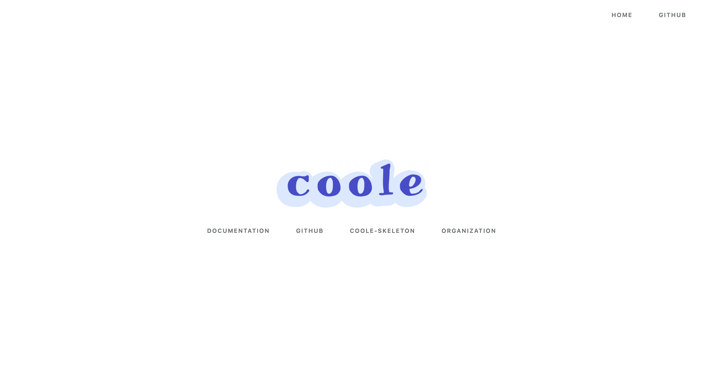

> Coole 部署在 Vercel 上的在线示例

<p align="center">
    <a href="https://coole.vercel.app"></a>
</p>

## Documentation

[www.guanguans.cn/coole](https://www.guanguans.cn/coole/)

## Requirement

* PHP >= 7.2

## Installation

``` bash
$ composer create-project coolephp/skeleton -vvv
```

## Quick start service

``` php
$ php coole serve
```

## Testing

``` bash
$ composer test
```

## Changelog

Please see [CHANGELOG](CHANGELOG.md) for more information on what has changed recently.

## Contributing

Please see [CONTRIBUTING](.github/CONTRIBUTING.md) for details.

## Security Vulnerabilities

Please review [our security policy](../../security/policy) on how to report security vulnerabilities.

## Credits

* [guanguans](https://github.com/guanguans)
* [All Contributors](../../contributors)

## License

The MIT License (MIT). Please see [License File](LICENSE) for more information.
